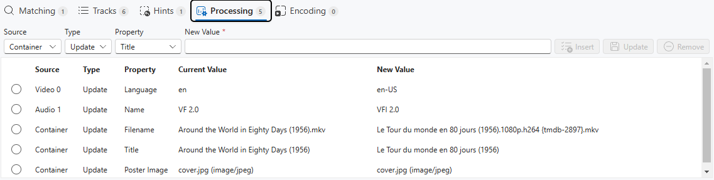

# Smart Video Processor

[](https://github.com/xfuentes/smart-video-processor/actions/workflows/build-linux.yml)
[](https://github.com/xfuentes/smart-video-processor/actions/workflows/build-windows.yml)
[](https://github.com/xfuentes/smart-video-processor/releases)


This small application in JavaScript is a frontend for various great free command line tools.
It uses Electron (https://www.electronjs.org/fr/), Fluent UI React (https://github.com/microsoft/fluentui) and
Vite (https://vite.dev/) frameworks.
Its purpose is to help process and encode your DVD or Blu-ray backups.
These can eventually be made with the excellent MakeMKV (https://www.makemkv.com/).

## 1) Installation

This application depends on FFmpeg and MKVToolNix (preferably release-95.0 and above).

### a) Ubuntu Linux
[](https://snapcraft.io/smart-video-processor)

Alternatively as debian package:
  ```shell
    sudo apt-get install mkvtoolnix ffmpeg
    sudo dpkg -i ./smart-video-processor_0.2.0_amd64.deb
  ```

### b) Windows 10 or later

Install MKVToolNix (https://www.matroska.org/downloads/mkvtoolnix.html)
and FFmpeg (https://ffmpeg.org/) you can get the binaries from: https://www.gyan.dev/ffmpeg/builds/
Run the Smart.Video.Processor-1.3.3.Setup.exe it will install and add a desktop shortcut.

## 2) Set your preferences

On the main toolbar click the settings button and the settings Dialog will open.
Set your preferences and click the Apply button.


## 3) Opening a video file

You can either open a file using the open button or by dragging and dropping the files you want to open directly in the
video list.
The program will then load the file and extract all the needed information.
In the background the great mkvmerge (https://www.matroska.org/downloads/mkvtoolnix.html) tool is run to retrieve
tracks and attachments. If some needed metadata are missing the file will be analysed further.


## 4) Matching

Using the filename of the video to process, guesses will be made to determine if the video is a movie or a TV Series
episode.

## 5) The video is a movie

From the filename some information can be extracted:
The title, the year, languages and version information.
You can complete or update required information about the movie until everything is correct and click the search button.
A request is made on TMDB (https://www.themoviedb.org/) to retrieve movie's details.
If the matched movie is not correct you have the possibility to select another match from the list.
The movie's poster and description are displayed you can now proceed to the next step.


## 6) The video is a TV Series episode.

From the filename some information can be extracted:
The title, the year, the season number, episode number, languages and version information.
You can complete or update required information about the episode until everything is correct and click the search
button.
A request is made on TheTVDB (https://thetvdb.com/) to retrieve series and episode details.
If the matched series and episode is not correct you have the possibility to select another match from the list.
The series and episode images and description are displayed you can now proceed to the next step.


## 7) Select tracks

Examine the track list and unselect the ones you want to remove.


## 8) Provide hints

If some information from the original file is missing or is incomplete hints will be requested.


## 9) Add/Review processing changes

Check the changes that will be done. You can also add some custom changes.



## 10) Choose tracks to encode and start processing

Select the video or audio tracks to encode. Depending on settings the program will auto-select the tracks
that needs encoding. Under the information icon you will see the selected codec and the expected size reduction.


Clicking the process button will start the processing. The file will be output on ./Reworked directory relative to
source file.
This can be changed in the settings.
For encoding audio or video files, ffmpeg (https://ffmpeg.org/) is launched in background.
For processing and adding poster to the mkv file mkvmerge (https://www.matroska.org/downloads/mkvtoolnix.html) is run in
background.

## 11) Wait for the processing to complete

You can see progression info and estimated time left.


